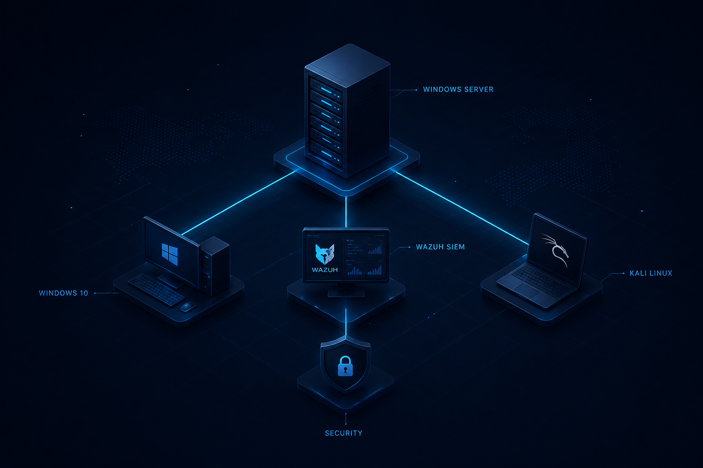

# 🛡️ Enterprise Cybersecurity Lab

Laboratorio empresarial de ciberseguridad desarrollado para practicar **Security Monitoring, SIEM, Windows Security, Active Directory, análisis de eventos y pruebas controladas de seguridad** en un entorno virtualizado.

## 🎯 Objetivo

Simular un entorno empresarial pequeño para desarrollar habilidades prácticas relacionadas con:

- Monitoreo de seguridad
- Análisis de logs
- SIEM
- Windows Security
- Active Directory
- Auditoría de eventos
- Endpoint Monitoring
- Detección de actividades sospechosas
- Pruebas controladas de seguridad
- MITRE ATT&CK

## 🏗️ Arquitectura

El laboratorio está compuesto por diferentes máquinas virtuales que simulan una infraestructura empresarial.

