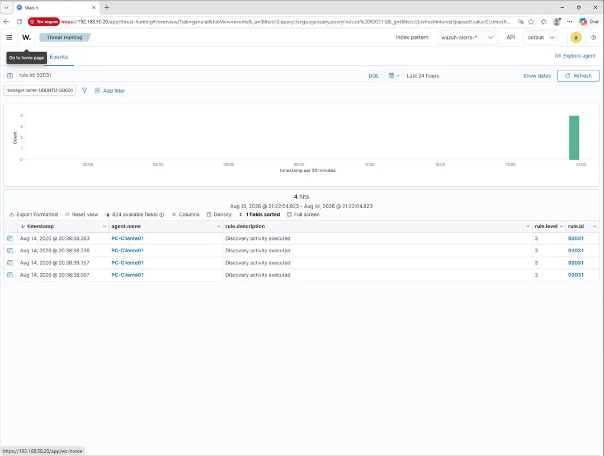

# Incidente 001 — Detección de actividad de descubrimiento

## 1. Resumen

Durante una prueba controlada realizada en el laboratorio de ciberseguridad se detectó actividad clasificada por Wazuh como:

**Discovery activity executed**

La detección fue registrada mediante la regla `92031` y se observaron cuatro eventos asociados al endpoint `PC-Cliente01`.

## 2. Entorno

- Windows Server 2022
- Windows 10 Pro
- Active Directory
- Ubuntu Server
- Wazuh SIEM
- Kali Linux
- VirtualBox

> La actividad corresponde a un entorno de laboratorio aislado.

## 3. Detección

### Regla de Wazuh

| Campo | Valor |
|---|---|
| Regla | `92031` |
| Descripción | `Discovery activity executed` |
| Nivel | `3` |
| Agente | `PC-Cliente01` |
| Eventos observados | `4` |
| Manager | `UBUNTU-SOC01` |
| Fecha observada | 14 de agosto de 2026 |
| Intervalo observado | Aproximadamente 20:38:38 |

## 4. Evidencia

La captura histórica del Wazuh Dashboard muestra cuatro eventos asociados a la misma regla `92031` en el agente `PC-Cliente01`.



## 5. Triage inicial

El análisis inicial considera:

- Identificar el endpoint afectado.
- Revisar la regla que generó la detección.
- Verificar la cantidad de eventos.
- Revisar la temporalidad de la actividad.
- Determinar el contexto de la actividad.
- Buscar eventos relacionados cuando exista acceso al entorno original.

Flujo de triage:

```text
Alerta de Wazuh
      ↓
Identificar regla
      ↓
Identificar endpoint
      ↓
Revisar cantidad de eventos
      ↓
Analizar temporalidad
      ↓
Determinar contexto
      ↓
Investigar eventos relacionados
